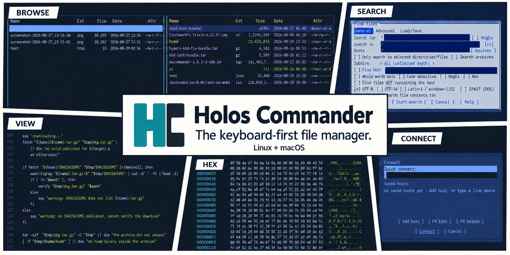

<div align="center">

# Holos Commander

### Two panels. Your whole filesystem. One terminal.

A keyboard-first file manager inspired by Total Commander.<br>
Browse, search, preview and move files across local folders, archives and remote hosts.

**Linux + macOS** &nbsp; | &nbsp; **x86_64 + arm64** &nbsp; | &nbsp; **MIT licensed**

[Install](#install) &nbsp; / &nbsp; [Explore the features](#made-for-more-than-moving-files) &nbsp; / &nbsp; [First steps](#your-first-minute) &nbsp; / &nbsp; [Releases](https://github.com/xls/hcmd/releases)

</div>



Familiar function keys. A streaming viewer. Remote connections that feel like
local folders. Holos brings the classic commander workflow to a modern terminal,
with tabbed panels, background jobs and a built-in shell to keep you moving.

## Install

**Get started on Linux or macOS:**

```sh
curl -fsSL https://raw.githubusercontent.com/xls/hcmd/master/install.sh | sh
hcmd
```

Prefer Node.js?

```sh
npx hcmd-installer
hcmd
```

Both installers choose the build for your platform and install the latest release
to `~/.local/bin`, without root. If `hcmd` is not found, add that directory to
your `PATH`, or launch `~/.local/bin/hcmd` directly.

**Already installed?** Run either installer again to update, or use
`npx hcmd-installer update`.

Want a package or a manual download? Get a **.deb**, **.rpm** or **tarball** from
[Releases](https://github.com/xls/hcmd/releases). Linux builds are available for
glibc and musl. There is no Windows build.

<details>
<summary><strong>Installer options and download verification</strong></summary>

- `HCMD_INSTALL_DIR`: binary location, default `~/.local/bin`.
- `HCMD_SHARE_DIR`: editable themes and example configuration, default `~/.local/share/hcmd`.
- `HCMD_VERSION`: release to install, default the latest.

The installers check downloads against the release's published `SHA256SUMS`.
They warn if checksums are unavailable; the shell installer also warns if neither
`sha256sum` nor `shasum` is installed.

You can review the [shell installer](install.sh) or the
[Node.js installer](packaging/npm/install.js) before running it.

</details>

<details>
<summary><strong>Distribution packages and building from source</strong></summary>

**Debian / Ubuntu:** download the `.deb` from Releases, then run:

```sh
sudo dpkg -i hcmd_*.deb
```

**Fedora / RHEL:** download the `.rpm` from Releases, then run:

```sh
sudo rpm -i hcmd-*.rpm
```

**Arch Linux:** from a checkout of this repository:

```sh
cd packaging/arch && makepkg -si
```

**From source:** requires Rust 1.95 or newer and a C compiler for the compression
and archive libraries. With `rustup`, the repository's `rust-toolchain.toml`
selects the pinned toolchain automatically.

```sh
git clone https://github.com/xls/hcmd
cd hcmd
cargo build --release
./target/release/hcmd
```

The binary is self-contained apart from libc and libstdc++.

</details>

## Made for more than moving files

### Keep both sides in view

Work with your source and destination side by side. Open **up to nine tabs per
panel**, jump to bookmarked directories, and preview a file in the opposite
panel without leaving the listing.

Copy and move with familiar function keys. Queue long operations in the
background, follow their progress, and keep browsing while they run.

[](docs/sample1.png)

**Two-panel browsing.** Source and destination side by side, with tabs and familiar function keys.

### Open the archive. Skip the unpacking.

Step into **ZIP, 7z, RAR and TAR** archives as if they were folders, including
archives inside archives. Formats are detected by content, so a renamed file
is still recognised.

Explore **ISO, FAT, ext2/3/4 and SquashFS disk images**, including GPT and MBR
partitions, with read-only browsing. Find the file you need and copy it out.

### Bring your servers into the same workflow

Connect over **SFTP, FTP, FTPS, SMB2/3, S3 or WebDAV**, then browse, view and copy
through the same panels you use locally. Saved passwords use the system keyring.

The protocols run in process, without an external `ssh` command or
`libsmbclient` installation.

[](docs/sftp-ftp-remote.png)

**Remote connections (`Ctrl+F`).** Quick connect or choose a saved host, then browse and copy through an ordinary panel.

### Look inside files of any size

Press **F3** for a streaming viewer that starts displaying a file without waiting
to load it all into memory. Read large logs, inspect highlighted source, or view
**JSON, HTML and Markdown** in document mode.

Switch to hex for the bytes behind the file. Built-in binary templates describe
**109 formats**, exposing details such as image dimensions and executable
architecture, with the corresponding regions highlighted in hex mode.

[](docs/viewer-syntax-highlight-and-selection.png)

**The viewer (`F3`).** Syntax highlighting, line numbers and selection details in the active theme.

[](docs/hexviewer.png)

**Hex mode.** Inspect a file's bytes, with offsets and ASCII side by side.

### Find it. Then work with it.

Search names and content across **local folders, remote connections and archives**.
Use masks, whole-word matching or regular expressions to narrow the search.
Results become a panel you can act on while the search is still running.

[](docs/findinfiles.png)

**Find Files (`Alt+F7`).** Search by name or content, including inside archives, and work with results as they arrive.

### See what changed in Git

Spot file status in the listing and the current branch in the status line.
Browse **commit history as folders**, open the files a commit changed, and compare
against `HEAD` or between panels with unchanged sections folded away.

Holos reads directly from the object store, without starting a `git` process.

### Make it your workspace

- **Rename in batches** with a preview and dedicated undo.
- **Verify and organise** with checksums, file splitting and merging, symlinks and permissions.
- **Drop into a persistent shell** with `Ctrl+O`, then return to your panels.
- **Find your look** with 21 built-in themes and a live preview picker (`Alt+T`).
- **Set your own shortcuts** with configurable key bindings and readable TOML settings.

[Explore the complete feature list](FEATURES.md)

## Your first minute

Start `hcmd` in a directory you know, then try these:

1. **Move around:** use the arrow keys and `Enter` to browse; `Tab` switches panels.
2. **Take a look:** highlight a file and press `F3` to open the viewer.
3. **Copy across:** choose a destination in the other panel, return to your file,
   and press `F5` to open the copy dialog.
4. **Find something:** press `Alt+F7` (or `Alt+S`) to search.
5. **Make it yours:** press `Alt+T` and preview a theme.

**Need a shortcut?** `F1` shows the keyboard reference for your terminal.
**Ready to leave?** `F10` or `Alt+Q` quits.

## Configuration

On first run, Holos writes commented configuration to `~/.config/holoscommander/`.
Uncomment a setting to override its default.

- **`config.toml`**: application settings, with defaults documented.
- **`keymap.toml`**: key bindings for each context.
- **`themes/`**: your custom theme files.
- **`hotlist.toml`**: directory bookmarks (`Ctrl+D`).
- **`hosts.toml`**: saved remote connections.

All 21 themes are built into the binary. To customise one, copy its installed
file from `~/.local/share/hcmd/themes/` into `~/.config/holoscommander/themes/`
and edit it. A matching name overrides the built-in theme; new names appear
alongside the defaults in the picker.

<details>
<summary><strong>Terminal compatibility and diagnostic commands</strong></summary>

Holos uses the Kitty keyboard protocol when available, allowing combinations
such as `Ctrl+Enter`, `Shift+F1`-`F10` and `Alt+F1`-`F12` to be distinguished.
For legacy terminals, affected bindings have documented `Alt`+letter fallbacks.
Press `F1` to see the bindings your terminal can deliver.

```sh
hcmd --keytest      # show how your terminal encodes each key
hcmd --check-config # validate configuration and exit
```

Set `HCMD_KEYBOARD_PROTOCOL=enhanced` or `HCMD_KEYBOARD_PROTOCOL=legacy` to
override automatic detection.

</details>

## Try it. Tell us what you think.

Put Holos to work on your everyday files. If something feels awkward, a terminal
behaves unexpectedly, or you have an idea for a better workflow,
[open an issue](https://github.com/xls/hcmd/issues). Include your operating system,
terminal and Holos version when reporting a problem.

For code contributions, start with [AGENTS.md](AGENTS.md), the guide to the
codebase and its checks. Run the full gate before committing:

```sh
./scripts/gate.sh gate-green
```

Before pushing, run `./scripts/gate.sh pre-push` as well.

<details>
<summary><strong>Building distribution packages</strong></summary>

```sh
cargo build --release
packaging/build-deb.sh       # -> dist/hcmd_<version>_<arch>.deb
packaging/build-rpm.sh       # -> dist/hcmd-<version>.<arch>.rpm
cd packaging/arch && makepkg # -> hcmd-<version>-1-<arch>.pkg.tar.zst
```

[GitHub Actions](.github/workflows/release.yml) builds releases for x86_64 and
arm64 on Linux (glibc and musl) and macOS.

</details>

## License

[MIT](LICENSE). Free to use, modify and share.
