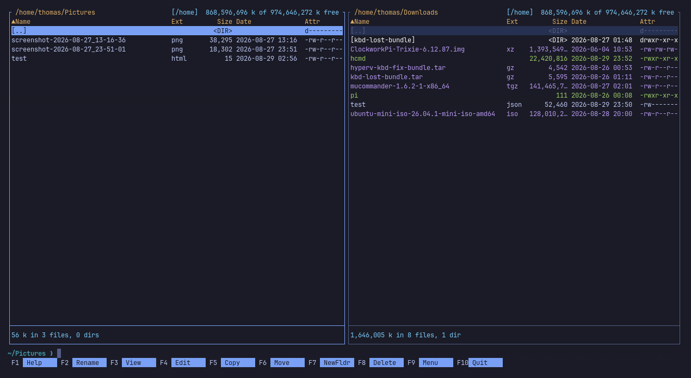
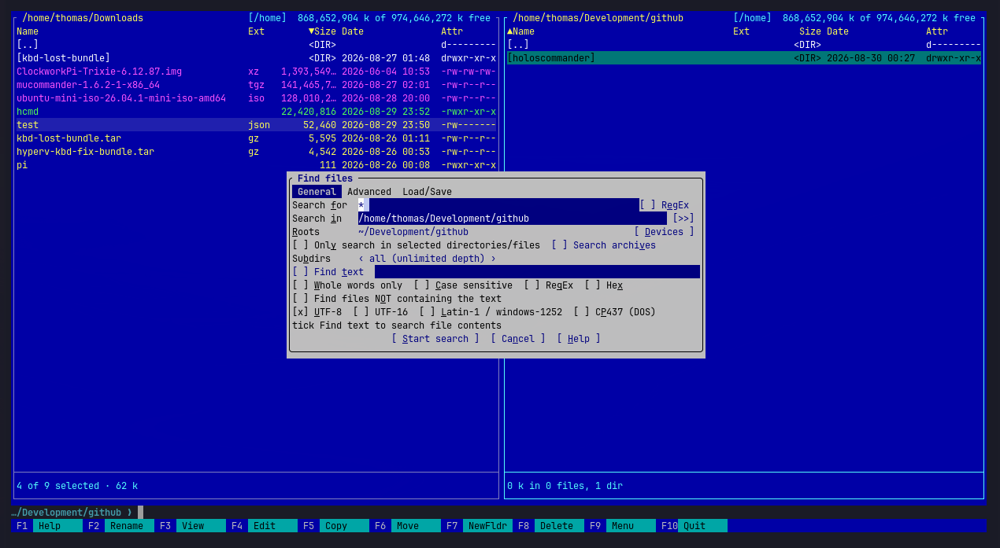
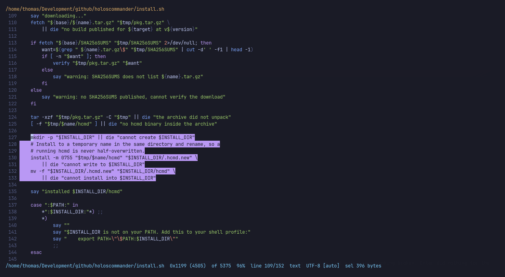
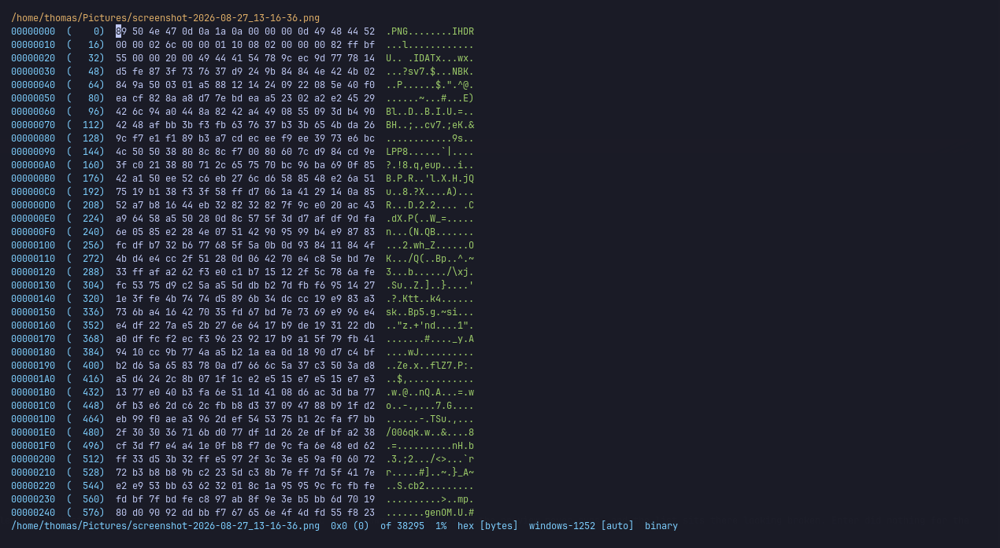
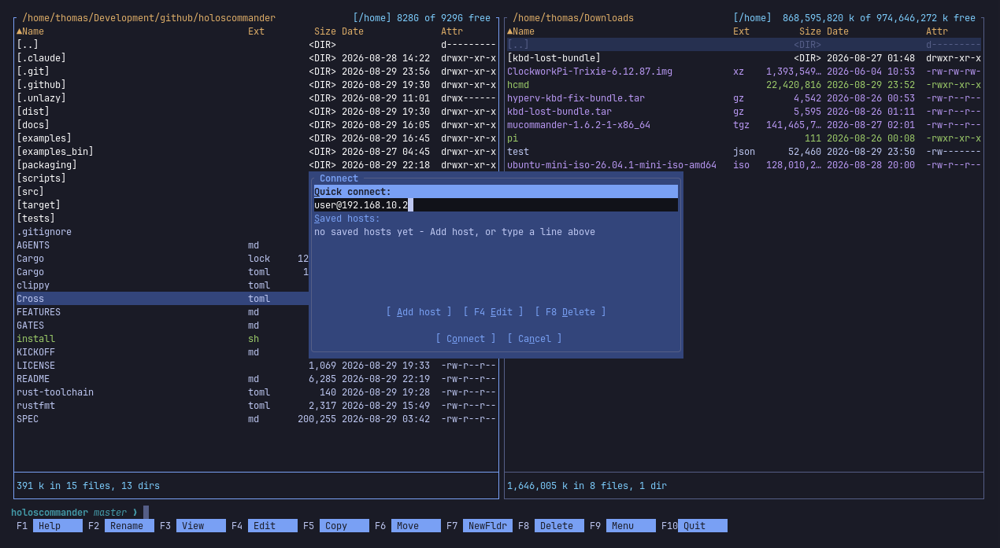

# Holos Commander

Holos is a Total Commander inspired file explorer for the terminal, for people whose fingers
learned `F5` in 1998 and have declined every opportunity to learn anything
else since. The default keys are mapped identical to Total Commander, because
rewiring twenty years of muscle memory is harder than writing a file manager.

There is mouse support. Please do not use it. Clicking around a commander is
like driving a manual and steering with your knees: technically possible, but
everyone in the car knows. The mouse is for selecting text and pasting it, and
that is the end of its remit.

Two panels, function keys where they have always been, and a viewer that opens
a 40 GB file as fast as a 4 KB one. Everything runs in process: no `rg`, no
`fd`, no `unzip`, no `ssh` binary. It does not shell out to do its own work.

Linux and macOS, on x86_64 and arm64; glibc and musl are both built. There is
no Windows build.



## What it does

**Panels**

- Two panels, up to nine tabs each, and the classic function-key layout.
- Columns you can reorder and sort by; they drop in a priority you choose as the panel narrows.
- Quick search, marking by mask, inverting, and marking what differs between the two sides.
- Directory sizes on demand, a flat recursive view of a whole tree, and bookmarked directories.
- A quick view that turns the opposite panel into a live preview of the file under the cursor.

**Files and archives**

- Copy, move, rename and delete, queued and running in the background.
- Archives are directories: zip, 7z, rar, tar and the usual compressions, nested, decided by content rather than by name.
- Disk images too: ISO 9660, FAT, ext2/3/4, SquashFS, and GPT or MBR partition tables.
- Multi-rename with a preview, checksums, splitting and merging, symlinks and permissions.

**Remote**

- SFTP, FTP and FTPS, SMB2/3, S3 and WebDAV, each a panel that behaves like a local one.
- All in process: no `ssh`, no `libsmbclient`, no FFI.
- Passwords live in the system keyring, never in a file.

**Viewer**

- Text, hex, and a document mode that renders JSON, HTML and Markdown as documents.
- Syntax highlighting, and streaming, so a 40 GB file opens as fast as a 4 KB one.
- Finds in whatever the mode is showing, with an encoding ring for a mis-detected file.
- Reads a file's own header and says what it is: a PNG's dimensions and colour type, an ELF's architecture. 109 formats, and hex mode paints the regions they describe.
- Opens a compiled Android manifest as the XML it was built from, and UTF-16 without a byte order mark as text.

**Git**

- Each file's state in the listing, with a directory answering for what is under it, and the branch on the status line.
- History browses as folders; entering a commit lists the files it changed and what it did to each.
- Diffs against `HEAD`, or between the two panels, with unchanged runs folded away.
- Read straight from the object store. No `git` process is started.

**Search**

- Names and content, over local trees, remote connections and inside archives.
- Results are a panel you can act on while the walk is still running.

**And the rest**

- A persistent shell that keeps its directory in step with the panel, and gives the panels back when a command finishes.
- TOML configuration, 21 themes with a picker that previews as you move, and every key rebindable.

See [FEATURES.md](FEATURES.md) for the full list.

## A look at it

<table>
<tr>
<td width="50%">

[](docs/findinfiles.png)

**Find Files (`Alt+F7`).** Name and content in one dialog, with the roots to
walk, the character sets to try, whole-word and regex, and a box for searching
*inside* archives. Results become a panel you can act on while the walk is
still running.

</td>
<td width="50%">

[](docs/viewer-syntax-highlight-and-selection.png)

**The viewer (`F3`).** Syntax highlighting in the active theme, line
numbers, and a selection reported in the status line - here `sel 396 bytes`
at `0x1199 (4505) of 5375`, with the encoding it decoded as.

</td>
</tr>
<tr>
<td width="50%">

[](docs/hexviewer.png)

**Hex mode.** A `.png` opened straight into hex, because the content said so
rather than the extension. Offsets in both bases, the bytes, and the ASCII
column beside them; selection works on the bytes themselves, and the status
line names the encoding and calls the file `binary`.

</td>
<td width="50%">

[](docs/sftp-ftp-remote.png)

**SFTP, FTP and SMB (`Ctrl+F`).** A quick-connect line or a saved host. Once
connected the panel is an ordinary panel: copy, view, search, and browse an
archive that lives on the far end.

</td>
</tr>
</table>

## Install

### The short way

```sh
curl -fsSL https://raw.githubusercontent.com/xls/hcmd/master/install.sh | sh
```

or, if you would rather go through Node:

```sh
npx hcmd-installer
```

Either one picks the right build for your platform, verifies it against the
release's published `SHA256SUMS`, and installs to `~/.local/bin`. Neither needs
root and neither writes anything outside the install directory. Both install
the **latest** release; run either again to update, or
`npx hcmd-installer update`, which says when there is nothing to do.

| Variable | Meaning |
| --- | --- |
| `HCMD_INSTALL_DIR` | where to put the binary (default `~/.local/bin`) |
| `HCMD_SHARE_DIR` | where to put the themes and the example config (default `~/.local/share/hcmd`) |
| `HCMD_VERSION` | which release to fetch (default the latest) |

All 21 themes are compiled into the binary, so they work with no files at all.
The copies installed beside it are the *editable* ones: to change a theme, copy
`themes/<name>.toml` into `~/.config/holoscommander/themes/` and edit it there.
A file of the same name overrides the built-in, and anything you put in that
directory appears in the `Alt+T` picker alongside the shipped ones.

Read the script first if you would rather not pipe one into a shell; that is a
reasonable thing to want, and it is 150 lines of POSIX `sh` with no
dependencies. The npm package is one Node file with no dependencies either.

### Packages

| Platform | Command |
| --- | --- |
| Debian, Ubuntu | download the `.deb` from [Releases](https://github.com/xls/hcmd/releases) and `sudo dpkg -i hcmd_*.deb` |
| Fedora, RHEL | download the `.rpm` and `sudo rpm -i hcmd-*.rpm` |
| Arch Linux | `cd packaging/arch && makepkg -si` |
| Anything else | download the tarball for your platform from Releases |

### From source

Rust 1.95 or newer. The repository pins a toolchain in `rust-toolchain.toml`, so
`rustup` will fetch the right one by itself.

```sh
git clone https://github.com/xls/hcmd
cd hcmd
cargo build --release
./target/release/hcmd
```

The binary is self-contained apart from libc and libstdc++. A C compiler is
required at build time, because a few of the compression and archive libraries
build C sources.

## Running it

```sh
hcmd                # start in the current directory
hcmd --keytest      # show how your terminal encodes each key
hcmd --check-config # validate the configuration and exit
```

Configuration is written to `~/.config/holoscommander/` on first run, commented
out, so the file documents itself and overriding a setting means uncommenting
it:

| File | Holds |
| --- | --- |
| `config.toml` | every setting, with its default shown |
| `keymap.toml` | every binding, per context |
| `themes/` | 21 colour schemes |
| `hotlist.toml` | directory bookmarks (`Ctrl+D`) |
| `hosts.toml` | saved SFTP, FTP and SMB connections |

`HCMD_KEYBOARD_PROTOCOL=enhanced|legacy` overrides terminal detection, which is
useful when a terminal answers a capability query badly.

### Terminals

The Kitty keyboard protocol is used where the terminal has it, which is what
makes `Ctrl+Enter`, `Shift+F1`-`F10` and `Alt+F1`-`F12` distinguishable. Without
it those keys cannot physically reach any program, so every one of them carries a
documented `Alt`+letter fallback, and `F1` shows you which bindings your terminal
can actually deliver.

## Building the packages

```sh
cargo build --release
packaging/build-deb.sh      # -> dist/hcmd_<version>_<arch>.deb
packaging/build-rpm.sh      # -> dist/hcmd-<version>.<arch>.rpm
cd packaging/arch && makepkg # -> hcmd-<version>-1-<arch>.pkg.tar.zst
```

Releases are built by GitHub Actions for x86_64 and aarch64 on Linux (glibc and
musl) and macOS. See [.github/workflows/release.yml](.github/workflows/release.yml).

## Contributing

[AGENTS.md](AGENTS.md) is the map of the codebase: what each module owns, which
invariants are load-bearing, where to add a feature, and how to run the checks.
Read it before a first change.

```sh
cargo fmt --check
cargo clippy --all-targets -- -D warnings
cargo test
```

All three must pass. Clippy denies the panic paths: no `unwrap`, no `expect`, no
indexing, no `unsafe`, in production code. Tests are exempt.

## License

MIT.
